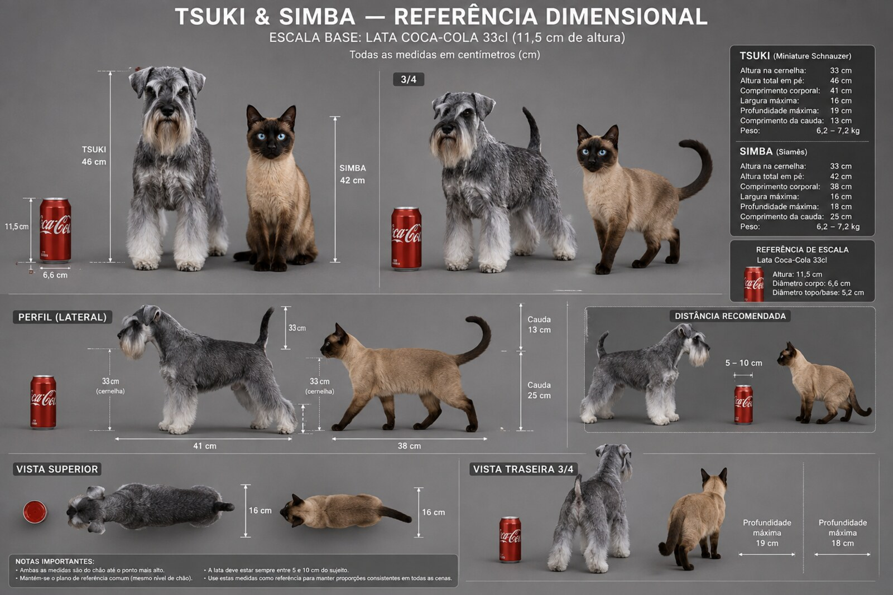
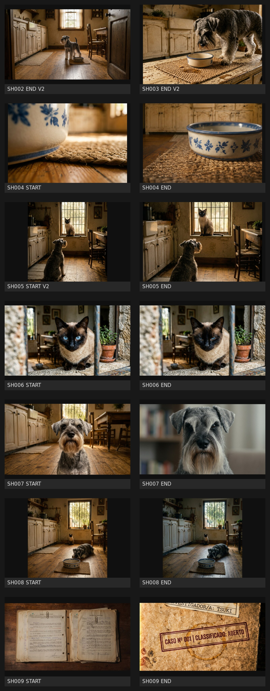

<p align="center">
  
</p>

# TSUKI_AMDK

> **PT-BR:** repositório de pré-produção, canon visual e pipeline de assets de **TSUKI — O Arquivo Morto da Cozinha**.  
> **EN:** pre-production repository, visual canon, and asset pipeline for **TSUKI — The Dead Kitchen Archive**.

## Logline

Tsuki, uma schnauzer miniatura de seriedade absoluta, trata pequenas ausências domésticas como casos periciais. Simba, um siamês observador, quase sempre sabe mais do que revela.

## Current status

- **Phase:** pre-production / visual development
- **Current episode:** `EP01 — CASO Nº 001 — O Biscoito Que Não Estava Lá`
- **Current build:** 9-shot operational cut
- **Visual lock:** 16mm observational domestic procedural
- **Dimensional lock:** active
- **Repository mode:** documentation-first

---

## Visual snapshot

<p align="center">
  
</p>

This preview reflects the current **EP01 still-development pass**, including the scale-corrected review phase.

---

## What this repository contains

### Core canon
- episode premise and factual timeline
- production rules and canon system
- visual bible and camera logic
- narrative layer rules for Tsuki / Simba / pet network

### Episode 01 production package
- script
- scene cards
- operational master
- final prompt package
- asset tracker
- voice direction and generated voice registry
- editorial timeline and review passes

### Reference assets
- character masters
- kitchen cardinal references
- prop references
- dimensional reference for Tsuki and Simba

### Generated development outputs
- review stills
- contact sheets
- local audio samples

> Generated outputs remain local by default under `outputs/` and are not committed automatically.

---

## Recommended reading order

### Start here
1. [`docs/core/00_episode_core.md`](docs/core/00_episode_core.md)
2. [`docs/core/01_production_core.md`](docs/core/01_production_core.md)
3. [`docs/core/02_visual_bible.md`](docs/core/02_visual_bible.md)

### Then move into EP01
4. [`docs/episodes/ep01/README.md`](docs/episodes/ep01/README.md)
5. [`docs/episodes/ep01/07_ep01_operational_master.md`](docs/episodes/ep01/07_ep01_operational_master.md)
6. [`docs/episodes/ep01/08_ep01_asset_tracker.md`](docs/episodes/ep01/08_ep01_asset_tracker.md)
7. [`docs/episodes/ep01/09_ep01_final_prompt_package.md`](docs/episodes/ep01/09_ep01_final_prompt_package.md)
8. [`docs/episodes/ep01/14_ep01_editorial_timeline_map.md`](docs/episodes/ep01/14_ep01_editorial_timeline_map.md)

### Important review/correction docs
- [`docs/episodes/ep01/16_ep01_dimensional_lock.md`](docs/episodes/ep01/16_ep01_dimensional_lock.md)
- [`docs/episodes/ep01/17_ep01_scale_correction_review.md`](docs/episodes/ep01/17_ep01_scale_correction_review.md)
- [`docs/episodes/ep01/18_ep01_sh007_regen_review.md`](docs/episodes/ep01/18_ep01_sh007_regen_review.md)

---

## Production logic

```text
DEFINE → REFERENCE → DESIGN → GENERATE → REVIEW → SELECT → PRESERVE → CONTINUE
```

This repository is organized around that chain.

---

## Canon summary

### Project rules
- Tsuki has **zero ironic consciousness**.
- Simba carries **observational irony**, but primarily in internal thought.
- Pets understand humans; humans do not understand pets.
- The series avoids pet-commercial tone, cartoon behavior, decorative prose, and generic AI melodrama.

### EP01 lock
- **9 shots**
- **dossier opens and closes the episode**
- **zero crumbs** as the principal forensic condition
- **no visible humans in frame**
- **the case remains open**

### Dimensional lock
Use [`assets/references/dimensional/Tsuki e Simba - referencia visual e dimencional.png`](assets/references/dimensional/Tsuki%20e%20Simba%20-%20referencia%20visual%20e%20dimencional.png) as the scale guide whenever body size matters.

---

## Repository structure

```text
TSUKI_AMDK/
├── README.md
├── assets/
│   └── references/
│       ├── characters/
│       ├── dimensional/
│       ├── locations/
│       └── props/
├── docs/
│   ├── core/
│   ├── episodes/
│   │   └── ep01/
│   ├── media/
│   └── storyboards/
├── outputs/
│   ├── audio/
│   └── renders/
└── .github/
```

---

## Key paths

### Core docs
- [`docs/core/`](docs/core/)
- [`docs/README.md`](docs/README.md)

### Episode 01 docs
- [`docs/episodes/ep01/`](docs/episodes/ep01/)

### References
- [`assets/references/characters/`](assets/references/characters/)
- [`assets/references/locations/`](assets/references/locations/)
- [`assets/references/props/`](assets/references/props/)
- [`assets/references/dimensional/`](assets/references/dimensional/)

### Outputs
- [`outputs/README.md`](outputs/README.md)

---

## How to use this repo

### If you are writing
Use:
- core brief
- production core
- scene cards
- script

### If you are generating visuals
Use:
- visual bible
- dimensional lock
- episode operational master
- final prompt package
- reference assets in `assets/references/`

### If you are producing edits/audio
Use:
- voice direction
- cast registry
- audio cue sheet
- editorial timeline map
- asset tracker

---

## Episode 01 roadmap

- [x] core brief consolidated
- [x] operational production docs created
- [x] voice auditions selected
- [x] voice clips generated
- [x] first still-development passes generated
- [x] dimensional correction applied
- [ ] stills promoted to locked masters
- [ ] motion pass generated
- [ ] editorial assembly cut
- [ ] final master export

---

## GitHub and repository profile

Suggested repository profile metadata lives in:
- [`docs/REPOSITORY_PROFILE.md`](docs/REPOSITORY_PROFILE.md)

Suggested description:
> Production bible, visual canon, prompts, and asset pipeline for TSUKI — O Arquivo Morto da Cozinha.

---

## Notes

- The repository is optimized for **clarity of production** over novelty.
- `outputs/` is intentionally treated as a local working area.
- Curated README visuals live in `docs/media/` so GitHub can display them.

## Credits

Creative and production development organized in this repository for the **TSUKI_AMDK** project.  
Repository structuring and production-system support in this pass were prepared in Arena.ai Agent Mode.
